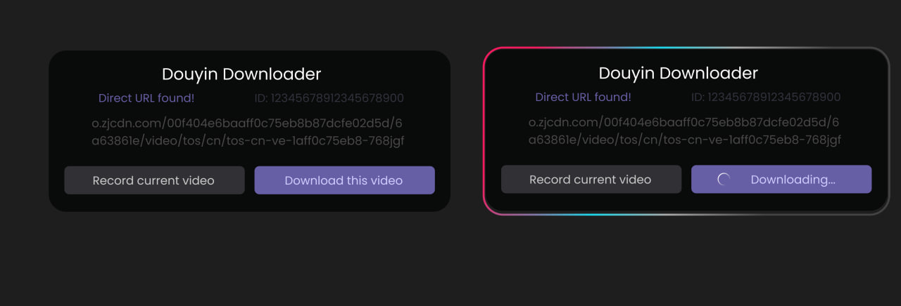

# Douyin Video Downloader

This extension helps download Douyin videos from the browser. It adds a small panel on the page that can detect the current video and provide a download option.

[click me! |  Check it out and please leave a review if possible](https://addons.mozilla.org/addon/douyin-videos-downloader/)

## What it does

- Detects the video currently shown on a Douyin page
- Shows a download panel inside the page
- Offers a direct download option when a video URL is found
- Can record the current video from the page when direct download is not available
- Stores simple settings in the browser

## Supported browser

- Firefox with a compatible version

## Installation

https://addons.mozilla.org/en-US/firefox/addon/douyin-videos-downloader/

## How to use

1. Open Douyin in the browser.
2. Open the extension from the toolbar.
3. Visit a video page.
4. The panel will try to detect the active video.
5. Use the download button or recording button shown on the page.

## Notes

- This tool depends on the current website structure and may not work for every page or every video.
- Some downloads may require a browser refresh or a different video page.
- The extension uses browser permissions for downloads and tab access.

## License

This project is licensed under the MIT License.

See the LICENSE file for the full text.
